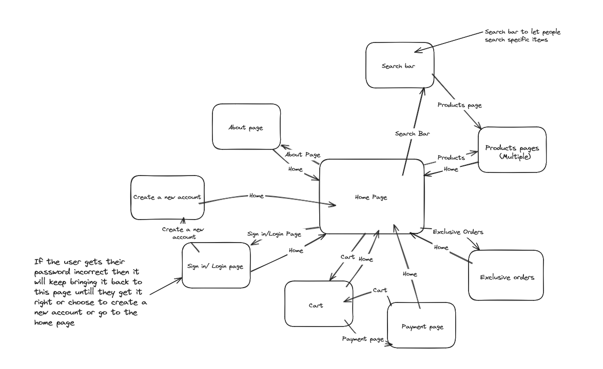

# Design of a Database-Driven Web Application for NCEA Level 3

Project Name: **Jess's Crochet Store**

Project Author: **Luke Scammell**

Assessment Standards: **91902** and **91903**

-------------------------------------------------

## System Requirements

### Identified Need or Problem
Popularity/exposure, My friend makes crochet but doesn't have a website that she could use to get orders for her crochet products. 

### End-User Requirements

The customers wanting the Crochet: The website needs to be easy to use and look good, they need to be able to see the products. 

- Ask some family members or friends to try out the website and give feedback for further 

Jess (admin): can easily add products and move around the website easily, she can monitor the sales easily and sort the prices. 

- Get images and prices for the different products she wants to sell.  
- Ask her what she wants her website to look like, getting colors and layouts. 

### Proposed Solution

- Easy to use and navigate
- Looks good 
- The user knows when they have brought something 
- You can order different Crochet items. 
- You can have an account that saves what you brought. 
- The admin can see stock and add new products 

-------------------------------------------------

## Relevant Implications

### Functionality

Making the buttons and website work and function like they are supposed to

If the any of the buttons don't work then the website wont be usable or people wont be able to buy stuff which would be bad for Jess.

Testing everything multiple times and having people try to break the website to find bugs to make my website bug free.

### End-User

My end Users will be the companies owner Jess Smythe and the customers

If the website isn't made with the customers and the owner in mind then it will be useless 

Making sure the owner is happy with how the website works and looks and also testing it with other people to see the customer experience and change the website from the feedback given.

### Future Proofing

The information/ data on the website can be changed in the future if needed and it will be to change.

Jess(admin) will be able to add or delete products from the shop page and also change the prices of the products easily.

I will need to make the features that let Jess(admin) to change the price and add/delete products easy to use and function properly.

### Usability

The website can be used for the purpose given from the need/problem

If the website cant be used for its purpose of buying Jess's crochet products then people wont use it.

When testing ill make sure to use the website and check its usability by acting like a customer and testing the flow of the website.

-------------------------------------------------

## Relevant User Experience (UX) Principles

### Give the user control 

The users will have a chance to have a choice to change their mind on a function 

The customer can have a choice for adding more products or deleting products from their cart and the website should have buttons that show the user that they can make that choice

Putting in exit buttons, delete item buttons and add item buttons to allow the user to control what they have in their cart

### Consistency 

Keeping the website consistent with the features and layout of the website with other known websites giving the same purpose

If a website is a store website then if we use a different layout or features people will get confused when using the website which will make it hard to use

Researching different store websites and using features and layouts in my website design

### Use visual Hierarchy

Making the important parts of the website visible by making things bigger or having contrasting colors.

Choosing a good color pallet that corresponds and works well with the items on the website so they stand out and draws the attention of the customer.  

Asking my end users how different colors feel with the product and if it works with the rest of the website and change the colors from their feedback.

-------------------------------------------------

## Final System Design

### Database Structure

Place a image here that shows the *final design* of your database: tables, fields and relationships.

### User Interface Design

-------------------------------------------------

## Completed System

### Database Structure

Place a image here that shows the *actual database structure* that you implemented: tables, fields and relationships.

### User Interface Design

Place screenshots and notes here that show your *actual system UI* in action.

-------------------------------------------------

## Review and Evaluation

### Meeting the Needs of the Users

Replace this text with a brief evaluation of how well you met the needs of your users. Look at what you initially wrote about who they are, what specific needs they have, etc. and discuss how well the system meets those needs.

### Meeting the System Requirements

Replace this text with a brief evaluation of how well you met the requirements that you defined at the start of the project, etc. Look back at the list of features / functionality you initially set and discuss how well your system has implemented each one.

### Review of IMPLICATION NAME HERE

Replace this text with brief notes showing how the implication was addressed in the final outcome. Accompany the notes with screenshots / other media to illustrate specific features.

### Review of IMPLICATION NAME HERE

Replace this text with brief notes showing how the implication was addressed in the final outcome. Accompany the notes with screenshots / other media to illustrate specific features.

### Review of IMPLICATION NAME HERE

Replace this text with brief notes showing how the implication was addressed in the final outcome. Accompany the notes with screenshots / other media to illustrate specific features.

### Review of UX PRINCIPLE NAME HERE

Replace this text with brief notes showing how the UX principle was addressed in the final outcome. Accompany the notes with screenshots / other media to illustrate specific features.

### Review of UX PRINCIPLE NAME HERE

Replace this text with brief notes showing how the UX principle was addressed in the final outcome. Accompany the notes with screenshots / other media to illustrate specific features.

### Review of UX PRINCIPLE NAME HERE

Replace this text with brief notes showing how the UX principle was addressed in the final outcome. Accompany the notes with screenshots / other media to illustrate specific features.

