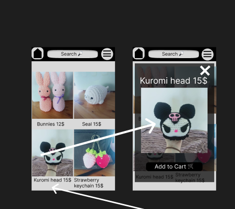
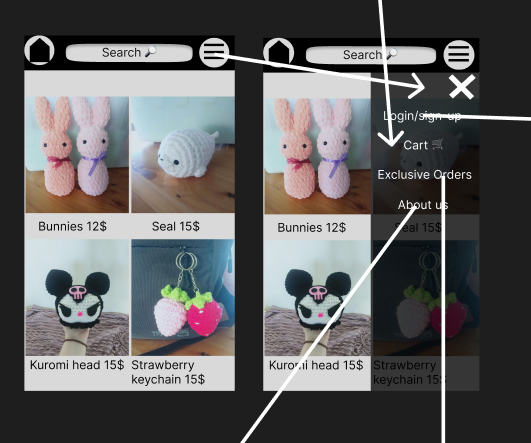
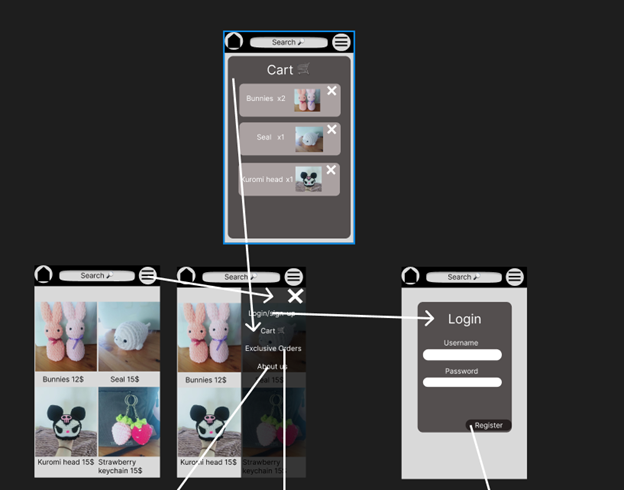

# Development of a Database-Driven Web Application for NCEA Level 3

Project Name: **Jess's Crochet Store**

Project Author: **Luke Scammell**

Assessment Standards: **91902** and **91903**

-------------------------------------------------

## Design, Development and Testing Log

### 28/05/2024

Making the Website structure Excalidraw

I used a Whiteboard app called Excalidraw to make this diagram showing the different pages that I want in my website and the arrows showing what part of the website can go to different pages. I looked at different shopping type websites and used different pages that they would have in those types of websites.

I chose to take the payment part out of the design because it would be too hard to implement

### 08/06/2024

Meeting my end user Jess at Mapua wharf and showing her my figma design
   [alt text](development.md)

Here is the images I showed Jess(My End User) and I asked her some questions about how I can improve the website and some features I could add in the final design

> Q1: What colors/ color palets where you thinking you would like to have for your website

> A1: I would like to have pastel colors, I want it to be colorful.

> Q2: Should I have a option for different color options for the products so if a customer wants a different color seal for example they could choose a color so you know which color wool to use
    
> A2: Yes, that would be a great idea.

> Q3: What do you wanna call your website?
    
> A3: Jess's Crochet
    
> Q4: Is there anything you would like to add to the design?
    
> A4: I was thinking about having a picture of my stall from the easter fair on the top of the home page.

 I Asked Jess these questions and she gave me some good feedback which I will implement into the design. I also explained that I will have to tweak the website a bit because I cant do the payment feature. 

### 09/06/2024

Filling out the development file with the responses i got from my end user 

I typed in the responses i got from Jess(My End User) and the images of the wireframe I made in figma.

### DATE HERE

Replace this test with what you are working on

Replace this text with brief notes describing what you worked on, any decisions you made, any changes to designs, etc. Add screenshots / links to other media to illustrate your notes where necessary.

> Replace this text with any user feedback / comments

Replace this text with notes describing how you acted upon the user feedback: made changes to design, etc.

### DATE HERE

Replace this test with what you are working on

Replace this text with brief notes describing what you worked on, any decisions you made, any changes to designs, etc. Add screenshots / links to other media to illustrate your notes where necessary.

> Replace this text with any user feedback / comments

Replace this text with notes describing how you acted upon the user feedback: made changes to design, etc.

### DATE HERE

Replace this test with what you are working on

Replace this text with brief notes describing what you worked on, any decisions you made, any changes to designs, etc. Add screenshots / links to other media to illustrate your notes where necessary.

> Replace this text with any user feedback / comments

Replace this text with notes describing how you acted upon the user feedback: made changes to design, etc.
