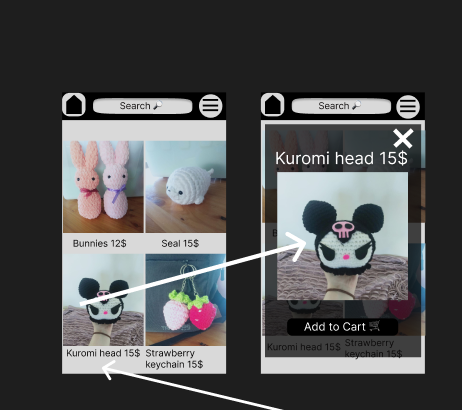
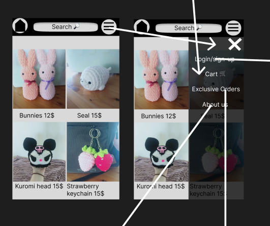
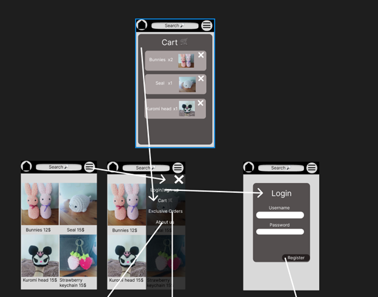
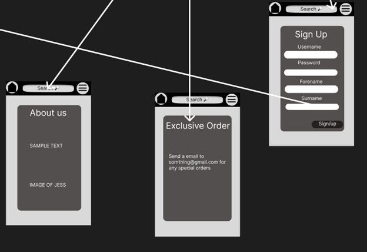

# Design of a Database-Driven Web Application for NCEA Level 3

Project Name: **Jess's Crochet Store**

Project Author: **Luke Scammell**

Assessment Standards: **91902** and **91903**

-------------------------------------------------

## System Requirements

### Identified Need or Problem
Popularity/exposure, My friend makes crochet but doesn't have a website that she could use to get orders for her crochet products. 

### End-User Requirements

The customers wanting the Crochet: The website needs to be easy to use and look good, they need to be able to see the products. 

- Ask some family members or friends to try out the website and give feedback for further 

Jess (admin): can easily add products and move around the website easily, she can monitor the sales easily and sort the prices. 

- Get images and prices for the different products she wants to sell.  
- Ask her what she wants her website to look like, getting colors and layouts. 

### Proposed Solution

- Easy to use and navigate
- Looks good 
- The user knows when they have brought something 
- You can order different Crochet items. 
- You can have an account that saves what you brought. 
- The admin can see stock and add new products 

-------------------------------------------------

## Relevant Implications

### Functionality

Making the buttons and website work and function like they are supposed to

If the any of the buttons don't work then the website wont be usable or people wont be able to buy stuff which would be bad for Jess.

Testing everything multiple times and having people try to break the website to find bugs to make my website bug free.

### End-User

My end Users will be the companies owner Jess Smythe and the customers

If the website isn't made with the customers and the owner in mind then it will be useless 

Making sure the owner is happy with how the website works and looks and also testing it with other people to see the customer experience and change the website from the feedback given.

### Future Proofing

The information/ data on the website can be changed in the future if needed and it will be to change.

Jess(admin) will be able to add or delete products from the shop page and also change the prices of the products easily.

I will need to make the features that let Jess(admin) to change the price and add/delete products easy to use and function properly.

### Usability

The website can be used for the purpose given from the need/problem

If the website cant be used for its purpose of buying Jess's crochet products then people wont use it.

When testing ill make sure to use the website and check its usability by acting like a customer and testing the flow of the website.

-------------------------------------------------

## Relevant User Experience (UX) Principles

### Give the user control 

The users will have a chance to have a choice to change their mind on a function 

The customer can have a choice for adding more products or deleting products from their cart and the website should have buttons that show the user that they can make that choice

Putting in exit buttons, delete item buttons and add item buttons to allow the user to control what they have in their cart. They will also be able to decide what color their products will be.

### Consistency 

Keeping the website consistent with the features and layout of the website with other known websites giving the same purpose

If a website is a store website then if we use a different layout or features people will get confused when using the website which will make it hard to use

Researching different store websites and using features and layouts in my website design

### Use visual Hierarchy

Making the important parts of the website visible by making things bigger or having contrasting colors.

Choosing a good color pallet that corresponds and works well with the items on the website so they stand out and draws the attention of the customer.  

Asking my end users how different colors feel with the product and if it works with the rest of the website and change the colors from their feedback.

-------------------------------------------------

## Final System Design

### Database Structure

### User Interface Design

-------------------------------------------------

## Completed System

 

In my final design I tried using all of the colors that my end user wanted and put corners on the images and buttons to give the website a slick feel. I Looked at existing shopping websites and used a similar layout so it would make the user experience easy becuase the users are familar with the layout

### Database Structure
     
  
 

### User Interface Design

Place screenshots and notes here that show your *actual system UI* in action.

-------------------------------------------------

## Review and Evaluation

### Meeting the Needs of the Users
Every piece of feedback I got from my end users I made sure to impliment thier ideas to the best of my ability and also make the website function the way I invisioned. I made sure to add admin capabilities so that (Jess) my end user can add her new products and can also see the orders that have been placed, with the date and time and also the address and username of the person who brought the product. 

Replace this text with a brief evaluation of how well you met the needs of your users. Look at what you initially wrote about who they are, what specific needs they have, etc. and discuss how well the system meets those needs.

### Meeting the System Requirements

I think I met the requirements pretty effectivly I tried my best to implement the features that I planned on using in my website. The features I think I implimented well is the cart system which is the main part of my website. I made it easy for users to add thier products and then put in a order for Jess to make the products. Some other features I think I did well was the adding product system and the order page for the admin. The login feature works like I wanted it and has no bugs which im happy with. There wre some features that I couldnt impliment becuase I didnt have time.

### Review of Functionality

All of the buttons I have tested and they work how they are supposed to. The nav buttons bring the user to the right page. The add to cart button adds the products to the cart and the adding new product form adds a all the inputs to the database and shows up on the website. 

### Review of End-User

Throughout the website making process I was checking with my End user(Jess) and having talks with her and asking her about the features and styling of the website and changing it if she doesnt like something. But there were some features that she thought would be good for her website that I couldnt implement becuase I didnt have the time to add that feature. Some of the features was a responsive page link bar which is the pop out bar that shows the links a bit better. The other features was showing the quantity and color varients of the products.

### Review of Future Proofing
 

To allow the website to have future proofing I allowed the admin to be able to add new products to the database and it will show up in the products part on the home page

Replace this text with brief notes showing how the implication was addressed in the final outcome. Accompany the notes with screenshots / other media to illustrate specific features.

### Review of Usability

I feel the final website is usable and fits its purpose as a shopping website for Jess's Crochet products and has a working cart and order system and makes it easier for Jess to grow her buisness and reach out to her customers.

Replace this text with brief notes showing how the implication was addressed in the final outcome. Accompany the notes with screenshots / other media to illustrate specific features.
### Review of Give the user control 
I think I could have done a better job with this if I had more time. But the features like being able to delete products and let the user descide on what they want to do with the products, I couldnt implement in time. If I were to do this again I would implement those things. 

Replace this text with brief notes showing how the UX principle was addressed in the final outcome. Accompany the notes with screenshots / other media to illustrate specific features.

### Review of Consistency 
 

For alot of the forms and buttons I reuse colors and shapes so it keeps a conisitant look and makes the website look farmiliar and help the user understand and know what action they are doing. Like for example the login form and sign in form has a similar look to other websites and when a user uses it they will know how to use the form becuase of the similar buttons and boxes which will give the website a smooth flow.

Replace this text with brief notes showing how the UX principle was addressed in the final outcome. Accompany the notes with screenshots / other media to illustrate specific features.

### Review of Use visual Hierarchy

 

With my website i worked with my end user by asking her what colors she wanted for my website and checked with her what parts of the website she wants with which color. The background color doesnt change but the forms and product borders have different colors which my end user loves and I think looks good.

