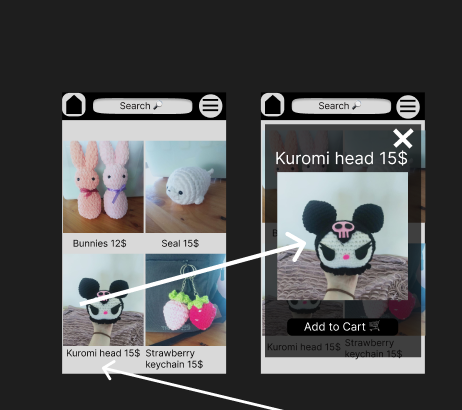
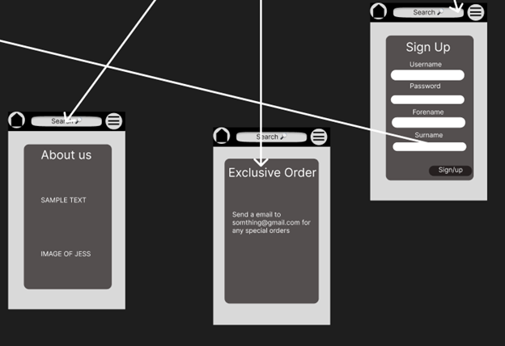

# Development of a Database-Driven Web Application for NCEA Level 3

Project Name: **Jess's Crochet Store**

Project Author: **Luke Scammell**

Assessment Standards: **91902** and **91903**

-------------------------------------------------

## Design, Development and Testing Log

### 28/05/2024

Making the Website structure Excalidraw

I used a Whiteboard app called Excalidraw to make this diagram showing the different pages that I want in my website and the arrows showing what part of the website can go to different pages. I looked at different shopping type websites and used different pages that they would have in those types of websites.

I chose to take the payment part out of the design because it would be too hard to implement

### 08/06/2024

Meeting my end user Jess at Mapua wharf and showing her my figma design
  

Here is the images I showed Jess(My End User) and I asked her some questions about how I can improve the website and some features I could add in the final design

> Q1: What colors/ color palets where you thinking you would like to have for your website

> A1: I would like to have pastel colors, I want it to be colorful.

> Q2: Should I have a option for different color options for the products so if a customer wants a different color seal for example they could choose a color so you know which color wool to use
 
 
    
> A2: Yes, that would be a great idea.

> Q3: What do you wanna call your website?
    
> A3: Jess's Crochet
    
> Q4: Is there anything you would like to add to the design?
    
> A4: I was thinking about having a picture of my stall from the easter fair on the top of the home page.

 I Asked Jess these questions and she gave me some good feedback which I will implement into the design. I also explained that I will have to tweak the website a bit because I cant do the payment feature. 

### 09/06/2024

Filling out the development file with the responses i got from my end user 

I typed in the responses i got from Jess(My End User) and the images of the wireframe I made in figma.

### 11/06/2024

Getting more feedback from my end user Jess with the color pallet

> Replace this text with any user feedback / comments

>I first asked if Jess's chats would allow to have her chats snipped for end user feedback then asked showed her some color pallets I found online
 
 

>She looked through them and then showed me some colors that she would like for her design 

### 25/06/2024

Asking my end user Jess if the users could be able to give their address when they are ordering

I asked my end user if the website should get the users address when they have pressed brought on the car

>My end user said Yes that would be a good idea

### 11/07/2024

Implementing the login and Sign up feature
# Login
I set up the login and sign up feature

After you click Login the Nav will turn into the screenshot below

## Sign Up

When you fill in the Sign up boxes it will bring you to a page which confirms if the account was created or not and will send the data to the database

### 12/08/2024
using the colours and layout from the mock up design and styling the website.

   

i used the colors that my end user provided and used the layout to base my website off of and styled it using css.

### 15/08/2024

Show the website with colours and functionality and change the website if i get any feedback.